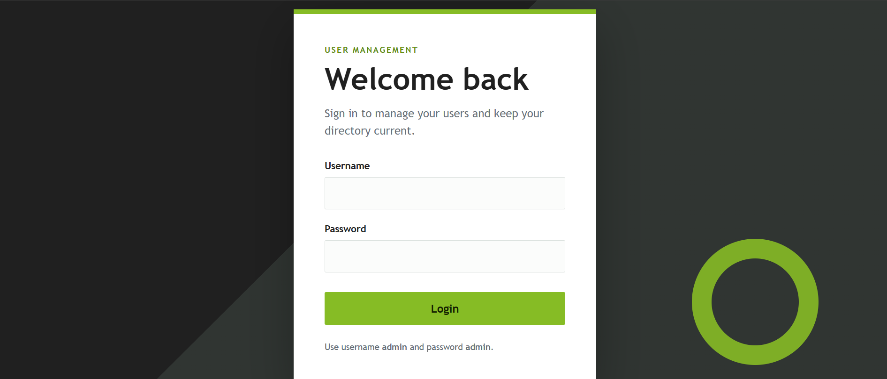
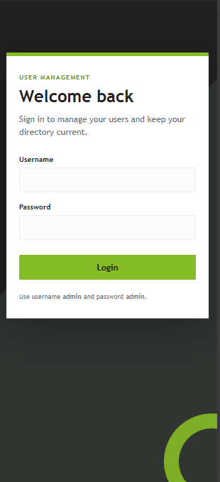
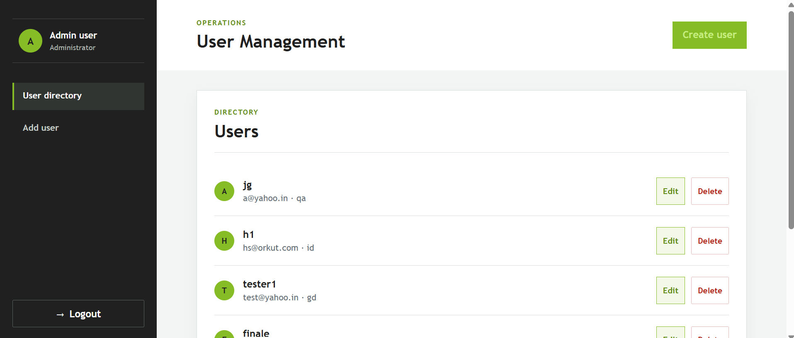
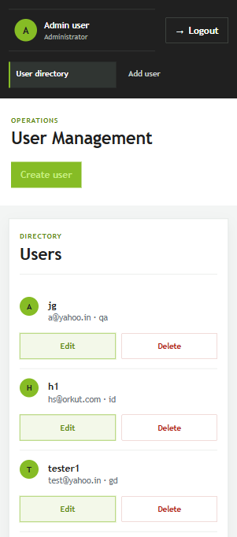
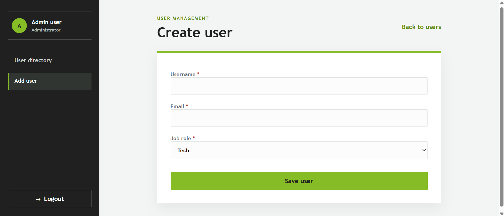
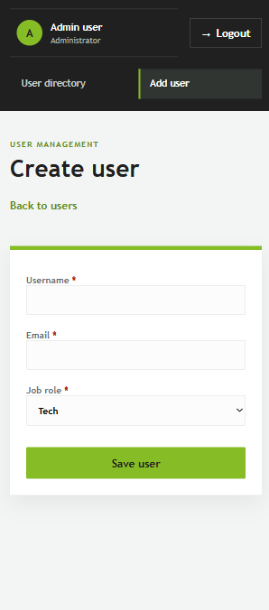

# User Management

A small user management application built with Angular, NgRx, Nx, and `json-server`. It provides a mocked login flow, a protected user directory, and full create, read, update, and delete workflows.

## Features

- Mock authentication with protected routes and logout.
- User directory loaded from a REST-style `json-server` API.
- Add, edit, and delete users through a shared reactive form and NgRx state.
- Loading states, save states, confirmation dialog, and success/error notifications.
- Responsive desktop and mobile layouts.
- Accessible labels, validation feedback, live status messages, keyboard-friendly controls, and dialog semantics.
- Unit coverage for services, reducers, effects, forms, login, and route protection.

## Screenshots

### Login

| Desktop                         | Mobile                                           |
| ------------------------------- | ------------------------------------------------ |
|  |  |

### User directory

| Desktop                                  | Mobile                                               |
| ---------------------------------------- | ---------------------------------------------------- |
|  |  |

### Create user

| Desktop                                     | Mobile                                                       |
| ------------------------------------------- | ------------------------------------------------------------ |
|  |  |

## Technology

- Angular 20 and TypeScript
- NgRx Store and Effects
- Nx 23 monorepo
- RxJS
- `json-server`
- SCSS
- Jest for library tests and Karma/Jasmine for application tests

## Setup

Requirements: Node.js 18 or newer and npm.

```bash
npm install
```

## Run the application

Start the Angular application and mock API together with one command:

```bash
npm start
```

Open [http://localhost:4200](http://localhost:4200).

The individual processes can also be started separately:

```bash
npm run api
npx nx serve user-management
```

The Angular development server runs on port `4200`. JSON Server runs on port `3000`.

## Authentication

Authentication is intentionally mocked for this assessment.

```text
Username: admin
Password: admin
```

Successful login stores the session flag in `localStorage` and redirects to `/users`. Unauthenticated users are redirected to `/login` by the route guard.

## API

The mock database is `db/db.json`. The API base URL is configured in `apps/user-management/src/app/environments/environments.ts`.

| Method | Endpoint     | Purpose       |
| ------ | ------------ | ------------- |
| GET    | `/users`     | Load users    |
| POST   | `/users`     | Create a user |
| PUT    | `/users/:id` | Update a user |
| DELETE | `/users/:id` | Delete a user |

The application uses `UsersService` for HTTP calls. NgRx effects coordinate requests and dispatch success or failure actions. Components do not call `HttpClient` directly.

## Routes

| Route             | Purpose        | Protected |
| ----------------- | -------------- | --------- |
| `/login`          | Sign in        | No        |
| `/users`          | User directory | Yes       |
| `/post-users`     | Create user    | Yes       |
| `/edit-users/:id` | Edit user      | Yes       |

## Architecture

```text
apps/user-management
  app.config.ts       Application providers and NgRx registration
  app.routes.ts       Routing and auth guard integration
  login/              Login screen

libs/auth/data-access         Auth actions, reducer, effects, selectors
libs/auth/feature-login       Auth feature library
libs/users/data-access        User model, HTTP service, store, effects
libs/users/feature-user-list  Dashboard and user directory
libs/users/feature-user-form  Create/edit form
libs/shared/ui                Toast and loading indicator components

db/db.json                    JSON Server data source
```

The application registers the feature state and effects at bootstrap:

```ts
provideStore();
provideState(usersFeature);
provideState(authFeature);
provideEffects(UsersEffects, AuthEffects);
```

The shared user contract is:

```ts
interface User {
  id?: number;
  username: string;
  email: string;
  jobRole: 'tech' | 'id' | 'gd' | 'qa';
}
```

## Validation and accessibility

- Required fields use Angular reactive-form validators and native required attributes.
- Email input uses email validation and reports an associated error message.
- Form controls expose invalid state through `aria-invalid` and `aria-describedby`.
- Loading and toast messages use live-region semantics.
- Navigation uses semantic links and `nav` landmarks.
- Delete confirmation uses `alertdialog`, `aria-modal`, labelled title, and description.
- Controls meet touch-friendly sizing expectations and layouts avoid horizontal overflow on mobile.

## Testing and build

Run all library lint targets:

```bash
npm run lint
```

Run the browser-independent Jest suites:

```bash
npx nx run-many -t test --projects=data-access,users-data-access,feature-login,feature-user-form,feature-user-list --runInBand --outputStyle=static
```

Run the Angular application tests:

```bash
npx nx test user-management --watch=false
```

The application test target uses Karma and requires Chrome or Chromium. In a headless container, configure `CHROME_BIN` or install a browser before running it.

Build the production application:

```bash
npm run build
```

Build output is written to `dist/user-management`.

## Design decisions

- NgRx owns authentication and user state so asynchronous workflows remain explicit and testable.
- HTTP access is isolated in `UsersService`; effects handle API orchestration and user feedback.
- One form component supports both create and edit flows to keep validation and interaction consistent.
- Add and edit navigation occurs only after the API reports success; pending saves disable duplicate submission.
- The API base URL is environment-configurable, keeping the local mock backend replaceable.
- Shared UI components centralize toast notifications and loading feedback.
